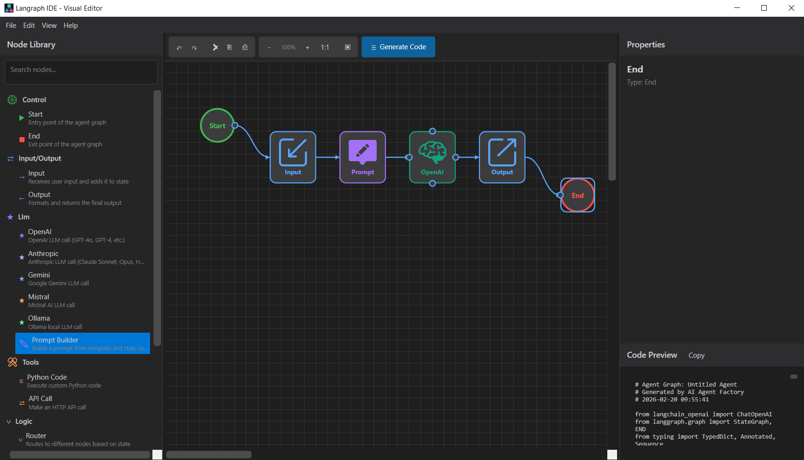

# Langraph IDE

A standalone visual editor for designing and generating [Langraph](https://github.com/langchain-ai/langgraph) AI agent workflows. Build complex multi-node agent graphs through a drag-and-drop interface and instantly export them as ready-to-run Python code — no backend server required.



---

## Features

- **Visual graph editor** — drag nodes onto the canvas and connect them with edges to define the agent flow
- **Rich node library** — pre-built nodes for LLMs (OpenAI, Anthropic, Gemini, Mistral, Ollama), prompt building, tools (Python code, API calls), memory, RAG, routing logic, and custom nodes
- **Conditional edges** — add routing conditions between nodes with an inline condition editor
- **Real-time code preview** — the generated Langraph Python code updates live as you design the graph
- **Export to Python** — save the generated code as a `.py` file ready to execute
- **Save / Open graphs** — persist your agent designs as `.agent.json` files and reload them later
- **Dark theme UI** — clean, modern dark interface built with WPF

---

## Requirements

| Requirement | Version |
|---|---|
| .NET SDK | 8.0 or later |
| Windows | 10 / 11 (WPF) |

---

## Build & Run

```bash
# Clone the repository
git clone <repo-url>
cd langraph-ide

# Restore dependencies and build
dotnet build LangraphIDE.csproj

# Run the application
dotnet run --project LangraphIDE.csproj
```

Or open `LangraphIDE.csproj` directly in **Visual Studio 2022** or **JetBrains Rider** and press **F5**.

---

## Usage

### Building an agent graph

1. **Drag** a node from the **Node Library** panel on the left onto the canvas.
2. **Connect** nodes by dragging from the blue output connector of one node to the input connector of another.
3. **Configure** each node by selecting it — the **Properties** panel on the right shows all editable parameters.
4. **Add routing conditions** on any edge by right-clicking it.

### Keyboard shortcuts

| Shortcut | Action |
|---|---|
| `Ctrl+N` | New agent |
| `Ctrl+O` | Open graph file |
| `Ctrl+S` | Save graph file |
| `Ctrl+Z` | Undo |
| `Ctrl+Y` | Redo |
| `Ctrl+C / X / V` | Copy / Cut / Paste nodes |
| `Del` | Delete selected nodes |
| `Ctrl+A` | Select all |

### Saving and loading graphs

- **File → Save** (`Ctrl+S`) — saves the graph as an `.agent.json` file.
- **File → Open** (`Ctrl+O`) — opens an existing `.agent.json` file.
- **File → Export Python Code** — exports the generated Python code as a `.py` file.

---

## Project Structure

```
langraph-ide/
├── LangraphIDE.csproj          # Project file (.NET 8, WPF)
├── App.xaml / App.xaml.cs      # Application entry point & theme initialization
├── MainWindow.xaml / .cs       # Main window layout and logic
├── ThemeManager.cs             # Dark/light theme switcher
│
├── Controls/
│   ├── AgentCanvas             # Drag-and-drop graph canvas
│   └── AgentNode               # Visual node control
│
├── Models/
│   ├── GraphModels.cs          # Graph data structures (nodes, edges, metadata)
│   ├── LangraphModels.cs      # Langraph-specific code generation models
│   ├── NodeDefinitions.cs      # Node definition schema
│   └── AgentInputSettings.cs   # Input persistence models
│
├── Services/
│   ├── PythonCodeGenerator.cs  # Converts graph data → Langraph Python code
│   └── GraphSerializer.cs      # JSON serialization for .agent.json files
│
├── Windows/
│   ├── EditorDialog            # Full-screen code/text editor (AvalonEdit)
│   └── ConditionInputDialog    # Edge condition input dialog
│
├── Helpers/
│   └── StringHelpers.cs        # String utility methods
│
├── Themes/
│   └── DarkTheme.xaml          # Dark color palette
├── Styles/
│   └── CommonStyles.xaml       # WPF control styles
│
├── Data/
│   └── nodes.json              # Node library definitions and templates
│
└── Resources/
    └── *.svg                   # Node icon assets
```

---

## Node Types

| Category | Nodes |
|---|---|
| **Control** | Start, End |
| **Input/Output** | Input, Output |
| **LLM** | OpenAI, Anthropic, Gemini, Mistral, Ollama, Prompt Builder |
| **Tools** | Python Code, API Call |
| **Memory** | State Reader, State Writer |
| **RAG** | Retriever, Document Store |
| **Logic** | Router (conditional branching) |
| **Custom** | Custom Python node |

---

## Dependencies

| Package | Version | Purpose |
|---|---|---|
| [AvalonEdit](https://github.com/icsharpcode/AvalonEdit) | 6.3.1 | Syntax-highlighted code editor |
| [Newtonsoft.Json](https://www.newtonsoft.com/json) | 13.0.3 | JSON serialization |

---

## License

This project is provided as-is for internal use.
